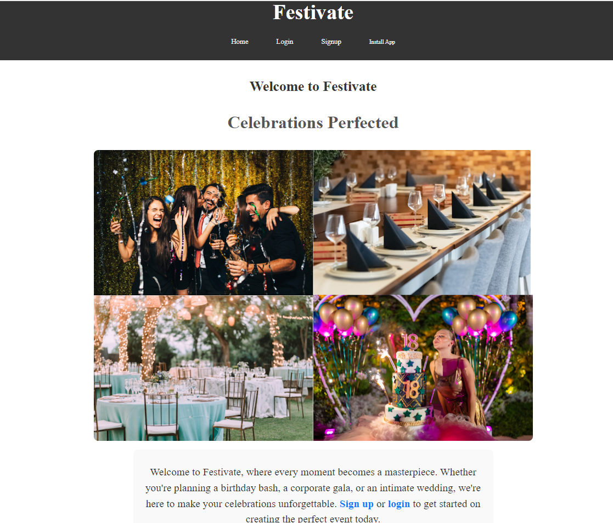
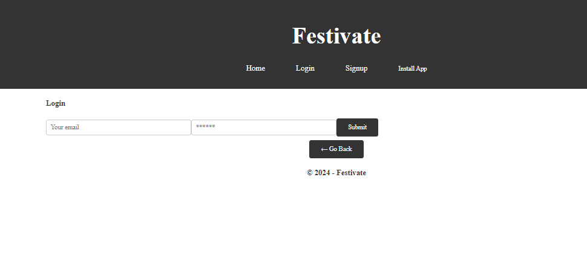
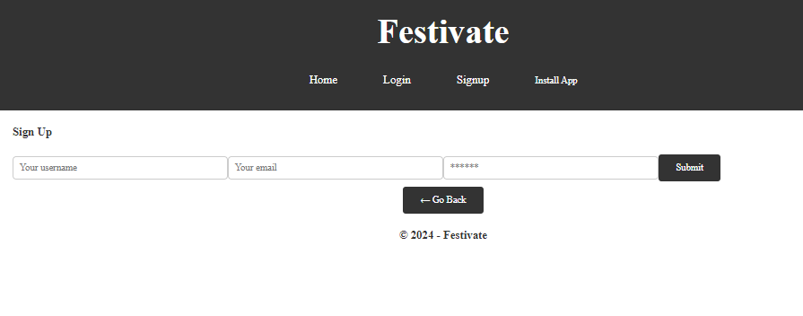
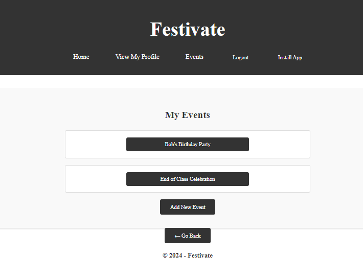
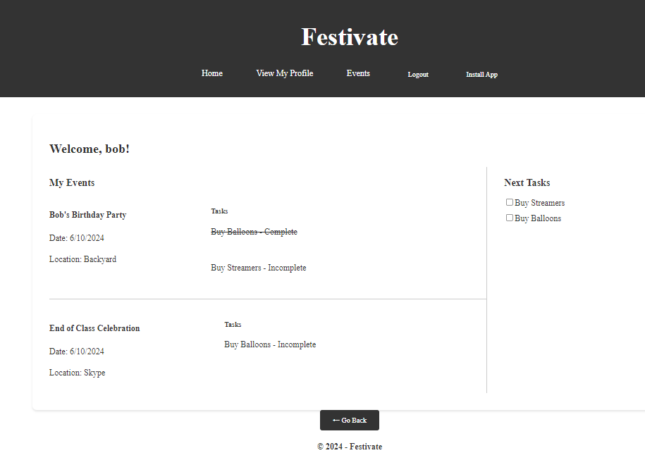

# Festivate: Celebrations Perfected

A party planning application. An all-encompassing digital platform that simplifies and streamlines the process of planning, organizing, and managing parties and events. This application aims to assist users in seamlessly handling everything from invitations to venue bookings, catering, and event scheduling, ensuring a memorable and hassle-free experience for both organizers and attendees.

Our challenge is to create a MERN stack single-page application that works with real world data to solve a real-world challenge, with focus on data and user demand. 

## User Story 
```
As a user, I want to register for an account on the event planner application, so that I can create and manage/track events.
```

## Acceptance Criteria
```
GIVEN an event planner application
WHEN I open the application.
THEN I am presented with a landing or homepage with a link to the login page or signup page.
WHEN I click on the link to log in or sign up, I am presented with a new page.
THEN I am presented with a log in or sign up option on my screen, plus empty fields to enter my username and password, or sign up.
WHEN I enter my login information, I am taken to my profile.
AT the top of the page after logging in, I am provided with an option to view my profile, and see my events. 
WHEN I click on the Events button,
THEN I am taken to my events page where I can see current events or I can add new events.
WHEN I click on an event, 
THEN I am taken to the individual event where I can see my information, and make edits or delete my event. I can also see a section of tasks associated with this event.
WHEN I click on Add Task, 
THEN I am given a form to fill in a new task and details about that task.
WHEN I select a task, I can edit the task, delete the task, or mark it as completed.
```
## Table of Contents

- [Installation](#installation)
- [Usage](#usage)
- [Links](#links)
- [Acknowledgements](#acknowledgements)
- [Resources](#resources)

## Installation

No istallation needed. Please select the link to the application here: [Festivate](https://festivate.onrender.com) and start planning your event as needed. 

## Usage

Select the link to sign up or log in and start with planning your event. 

Homepage


Login Page


Signup Page


Events Landing Page


Events Page


Profile Page


## Links

Deployed Link: https://festivate.onrender.com

Git Hub Link: https://github.com/avilwock/Festivate

## Acknowledgements

Amanda Vilwock (Project Manager) 

Sarah Davila (Front/Back End Support) 

Marisol Aranda (Front/Back End Support)

## Resources: 

Express.js Documentation: [Express.js Documentation](https://expressjs.com/)

Markdown Cheatsheet: [Markdown Cheatsheet](https://www.markdownguide.org/cheat-sheet/)

JSON Documentation: [JSON.org](https://www.json.org/json-en.html)

Node.js Documentation: [Node.js Documentation](https://nodejs.org/en/docs/)

Node.js Path: [Path](https://nodejs.org/api/path.html)

Mongoose (MongoDB connection): [MongoDB Connection](https://www.npmjs.com/package/mongoose)

GitHub Guides: [GitHub Guides](https://guides.github.com/)

Express.js Tutorial: [Express.js Tutorial: Building a Basic CRUD App](https://developer.mozilla.org/en-US/docs/Learn/Server-side/Express_Nodejs)

Render Deployment Guide: [Deploying Applications to Render](https://coding-boot-camp.github.io/full-stack/render/render-deployment-guide)

Configuring .npmrc: [.npmrc](https://docs.npmjs.com/cli/v7/configuring-npm/npmrc)

bcrypt: [.bcrypt](https://www.npmjs.com/package/bcrypt)

React Bootstrap Modals: [Modals React Bootstrap](https://react-bootstrap.netlify.app/docs/components/modal/)

Dependencies:

* Concurrently: https://www.npmjs.com/package/concurrently & https://github.com/open-cli-tools/concurrently

* dotenv: https://www.npmjs.com/package/dotenv 

* Scripts Documentation: https://docs.npmjs.com/cli/v7/using-npm/scripts

## Future Implementations:

* Add a section for sale of party items to the customers

* Create a guest list online with contact information

* Send invitations out through a mailing list, and track RSVPs

## License

This project is covered under the MIT license.

## Contributing
Please form the repository and add your code and submit your code for approval.

## Questions
For questions about this project, please visit Amanda Vilwock [GitHub profile](https://github.com/avilwock) or contact one of the contributors [Marisol Aranda](https://github.com/Marisol514) or [Sarah Davila](https://github.com/SDavila210).
